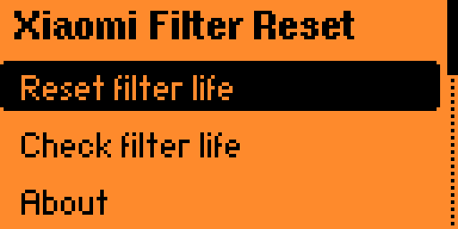

# Xiaomi Filter Reset

A [Flipper Zero](https://flipperzero.one/) app that resets the **filter-life counter**
on Xiaomi air purifier filters, so the appliance reports **100%** again — no filter
swap and no smartphone app required.

[](https://github.com/khmm12/flipper-xiaomi-filter-reset/actions/workflows/ci.yml)
[](./LICENSE)
[](https://flipperzero.one/)

> Xiaomi air purifier filters carry an NTAG213 NFC tag that the appliance uses to
> track "filter life" and nag you to buy a new (often perfectly good) filter. This
> app clears that usage counter directly on the tag. Vacuum or replace the actual
> filter media on your own schedule — this only resets the *counter*.

---

## Contents

- [Disclaimer](#disclaimer)
- [Compatibility](#compatibility)
- [How it works](#how-it-works)
- [Screenshots](#screenshots)
- [Install](#install)
- [Usage](#usage)
- [Build from source](#build-from-source)
- [Development](#development)
- [Project layout](#project-layout)
- [Contributing](#contributing)
- [Credits](#credits)
- [License](#license)

## Disclaimer

This tool is provided for **research, interoperability, and repair of hardware you
own**. Resetting the counter does **not** clean or restore the physical filter; a
saturated HEPA/carbon filter still needs cleaning or replacement for your air to be
clean. Use it to avoid throwing away filters that still have useful life, or to keep
using third-party filters. You are responsible for how you use it.

No warranty. See the [License](#license).

## Compatibility

The app works with Xiaomi air purifier filters whose tag is an **NTAG213**
(ISO 14443-3A / NfcA) using the vendor's UID-derived password scheme. This covers the
filters shipped with many Mi Air Purifier models (community reports include the
3H/3C, 4/4 Lite/4 Pro, and Pro/Pro H lines). Several distinct filter families have
been verified on real hardware, identified by their on-tag product code (`AP11`,
`JDA0`, and `JD26`).

The full reset has been confirmed end-to-end — write, verify, and the appliance
reporting 100% again — on the **Mi Air Purifier 4** and **Mi Air Purifier 4 Pro**.

Because the app authenticates using a password **derived from each tag's own UID**, a
successful reset is itself proof the tag is a supported Xiaomi filter. Foreign tags
simply fail authentication and are never written to.

> Not sure if your filter is supported? Just try it. If the tag is not a compatible
> Xiaomi filter, the app reports an authentication failure and leaves the tag
> untouched.

## How it works

1. The filter's NTAG213 stores a usage counter in page 8 and is password-protected
   (both read and write) from page 4 onward.
2. The 4-byte NTAG password is a deterministic function of the tag's 7-byte UID:
   a fixed selection of bytes from `SHA-1(UID)`.
3. The app reads the UID (always readable), derives the password, authenticates with
   `PWD_AUTH`, writes `00 00 00 00` to the counter page, and reads it back to verify.

The full reverse-engineering write-up, memory map, and the exact password algorithm
are in [`docs/protocol.md`](./docs/protocol.md).

## Screenshots

| Menu | Waiting for the tag | Done |
| :---: | :---: | :---: |
|  |  |  |

## Install

### Option A — Flipper App Catalog (recommended)

Search for **"Xiaomi Filter Reset"** in the Apps catalog inside
[qFlipper](https://flipperzero.one/update) or the mobile app and install it.

### Option B — Prebuilt `.fap`

1. Download `xiaomi_filter_reset.fap` from the
   [latest release](https://github.com/khmm12/flipper-xiaomi-filter-reset/releases) or
   from the [CI artifacts](https://github.com/khmm12/flipper-xiaomi-filter-reset/actions).
2. Copy it to your Flipper's SD card under `apps/NFC/`.
3. Launch it from **Apps → NFC → Xiaomi Filter Reset**.

Make sure the `.fap` matches your firmware channel (release vs. dev). The CI builds
for both.

## Usage

1. Open **Apps → NFC → Xiaomi Filter Reset** and choose **"Reset filter life"**.
2. Hold the filter's NFC tag flat against the **back** of your Flipper. The tag is
   usually a sticker or a small disc on the filter's cardboard rim.
3. Wait for **"Done! Filter life restored to 100%"**.
4. Reinsert the filter. The purifier now reports a fresh filter.

If it fails, the app tells you why (not a Xiaomi filter, tag moved, write rejected,
etc.) and offers a **Retry**.

### Check filter life (read-only)

**"Check filter life"** does the same authenticated read but never writes. It confirms
the tag is a genuine Xiaomi filter and reports whether it is **fresh** (counter at 0)
or has **been used** — handy to verify a filter before resetting, or to confirm a
reset took.

It deliberately does **not** show a percentage. The tag only stores *elapsed usage* in
unknown units; the full-scale value that maps to 0% lives in the appliance and differs
by filter model, so it is not on the tag. Any percentage would be a guess, and this app
only reports what the hardware actually tells it.

## Build from source

Builds use [`ufbt`](https://pypi.org/project/ufbt/), the micro Flipper Build Tool.

```sh
# 1. Install ufbt (once). Using mise? `mise install` provisions it from mise.toml.
python3 -m pip install --user ufbt

# 2. Build the app (downloads the matching SDK on first run)
ufbt

# 3. (Optional) Install straight onto a connected Flipper
ufbt launch
```

The resulting `xiaomi_filter_reset.fap` lands in `dist/`.

## Development

| Task | Command |
| --- | --- |
| Build the FAP | `ufbt` |
| Run on a connected Flipper | `ufbt launch` |
| Run host unit tests | `make -C test test` |
| Lint the pure core (strict warnings) | `make -C test lint` |
| Check formatting | `ufbt lint` |
| Auto-format all sources | `ufbt format` |

The cryptographic and memory-map logic lives in `src/core/` and has **no firmware
dependency**, so it is fully unit tested on the host. The very same object code is
compiled into the app, so the tests exercise exactly what ships. Password derivation
is validated against golden vectors read from real filter tags.

## Project layout

```
.
├── application.fam                # Flipper app manifest
├── mise.toml                      # optional toolchain (provisions ufbt)
├── xiaomi_filter_reset.c          # entry point + app lifecycle
├── xiaomi_filter_reset_i.h        # shared app state
├── icons/                         # 10x10 app icon
├── scenes/                        # UI scenes (start, reset, success, error, about)
├── src/
│   ├── core/                      # pure, host-testable core (SHA-1, filter logic)
│   └── nfc/                       # NTAG213 poller worker
├── test/                          # host unit tests + Makefile
├── docs/protocol.md               # reverse-engineering notes
├── catalog/                       # Flipper App Catalog submission manifest
└── .github/workflows/ci.yml       # build + test + lint
```

The firmware-coupled glue — the entry point and the UI `scenes/` — sits at the app
root next to `application.fam`, matching the layout of Flipper's own apps. The
portable, host-testable logic is deliberately isolated under `src/` (`core/` has no
firmware dependency and is unit-tested; `nfc/` is the thin device-driving layer).

## Contributing

Contributions are welcome — see [`CONTRIBUTING.md`](./CONTRIBUTING.md). In short:
conventional commits, keep the core firmware-free and tested, and run
`make -C test test` plus `ufbt lint` before opening a PR.

## Credits

This app stands on the reverse engineering done by others:

- [**flamingo-tech**](https://github.com/Flamingo-tech/xiaomi-air-purifier-reverse-engineering)
  — discovered the UID→password algorithm and the tag memory map.
- [**unethical.info**](https://unethical.info/2024/01/24/hacking-my-air-purifier/)
  — an excellent write-up of the whole DRM scheme.

## License

[GPL-3.0-or-later](./LICENSE). The bundled SHA-1 implementation (`src/core/sha1.*`) is
in the public domain (after Steve Reid's implementation).
